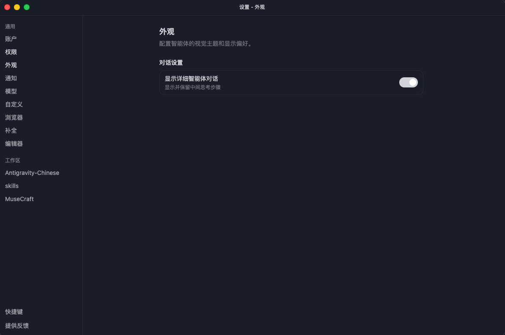
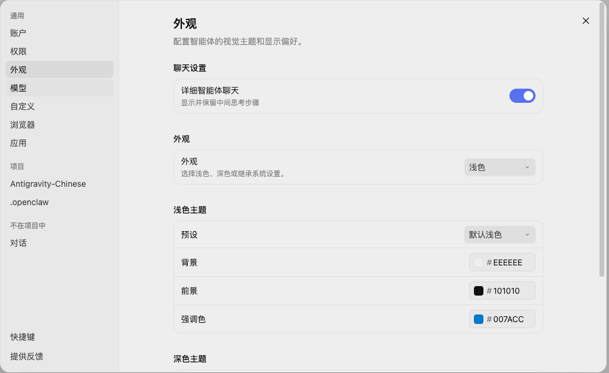

# Antigravity 汉化补丁

这是一个给本机 Antigravity 与 Antigravity IDE 使用的轻量汉化补丁工具。两个程序的安装结构不同，因此分别提供两个脚本。

- `antigravity_hanhua.py`：用于 `Antigravity` 外壳应用。
- `antigravity_ide_hanhua.py`：用于 `Antigravity IDE` 编辑器应用。

`Antigravity IDE` 脚本采用本地注入方式，在 `workbench.html` 和 `workbench-jetski-agent.html` 中加载 `antigravity_zh_cn.js`，通过 DOM 文本替换汉化常见菜单、命令、设置和 Antigravity 专属入口。

`Antigravity` 脚本会备份并重打包 `resources/app.asar`，静态替换安装向导、菜单、托盘和更新提示，并在 `preload.js` 中注入 DOM 汉化脚本，用于覆盖主窗口中由本地服务渲染的界面文本。

## 效果预览




## 当前定位

- Antigravity 适配路径（Windows）：`C:\Users\hongl\AppData\Local\Programs\Antigravity`
- Antigravity 适配路径（macOS）：`/Applications/Antigravity.app/Contents`
- Antigravity 已确认版本：`2.1.4`
- Antigravity IDE 适配路径（Windows）：`C:\Users\hongl\AppData\Local\Programs\Antigravity IDE`
- Antigravity IDE 适配路径（macOS）：`/Applications/Antigravity IDE.app/Contents`
- 已确认版本：Antigravity IDE `2.0.4`
- 已确认基线：VS Code `1.107.0`
- 方案类型：本地补丁，不是官方语言包

## 使用方式

### Antigravity

查看状态：

```powershell
python .\antigravity_hanhua.py status
```

安装汉化：

```powershell
python .\antigravity_hanhua.py install
```

恢复原始文件：

```powershell
python .\antigravity_hanhua.py restore
```

自检：

```powershell
python .\antigravity_hanhua.py check
```

对当前已打开窗口运行时注入：

```powershell
python .\antigravity_hanhua.py inject
```

如果安装路径不同：

```powershell
python .\antigravity_hanhua.py status --install-dir "D:\Tools\Antigravity"
```

### Antigravity IDE

查看状态：

```powershell
python .\antigravity_ide_hanhua.py status
```

安装汉化：

```powershell
python .\antigravity_ide_hanhua.py install
```

恢复原始文件：

```powershell
python .\antigravity_ide_hanhua.py restore
```

如果安装路径不同：

```powershell
python .\antigravity_ide_hanhua.py status --install-dir "D:\Tools\Antigravity IDE"
```

## 工作原理

脚本会做以下事情：

### Antigravity

1. 备份 `resources/app.asar`，备份后缀为 `.agzh.bak`。
2. 临时解包 `app.asar`。
3. 汉化安装向导、菜单、托盘、更新提示和打开工作区对话框。
4. 在 `dist/preload.js` 中注入 DOM 汉化脚本。
5. 在 `dist/utils.js` 中通过 Chrome DevTools Protocol 对主页面执行运行时汉化。
6. 重新打包并替换 `app.asar`。

### Antigravity IDE

1. 备份 `workbench.html` 和 `product.json`，备份后缀为 `.agzh.bak`。
2. 备份 `workbench-jetski-agent.html`，这个入口承载 Antigravity 的 Settings 等专属界面。
3. 生成 `antigravity_zh_cn.js`。
4. 在 `workbench.html` 的 `workbench.js` 前注入汉化脚本。
5. 在 `workbench-jetski-agent.html` 的 `jetskiAgent.js` 前注入汉化脚本。
6. 重新计算两个 HTML 文件的 SHA256 校验值。
7. 更新 `product.json` 中对应的 `checksums` 记录。

## 风险说明

- 这是本地补丁，会修改 Antigravity 或 Antigravity IDE 安装目录。
- Antigravity 更新后可能覆盖补丁，需要重新执行对应脚本的 `install`。
- 如果启动异常，执行对应脚本的 `restore` 恢复。
- 当前是首版词典，优先覆盖常见入口和 Antigravity 专属命令，后续可以继续补充未翻译文本。
